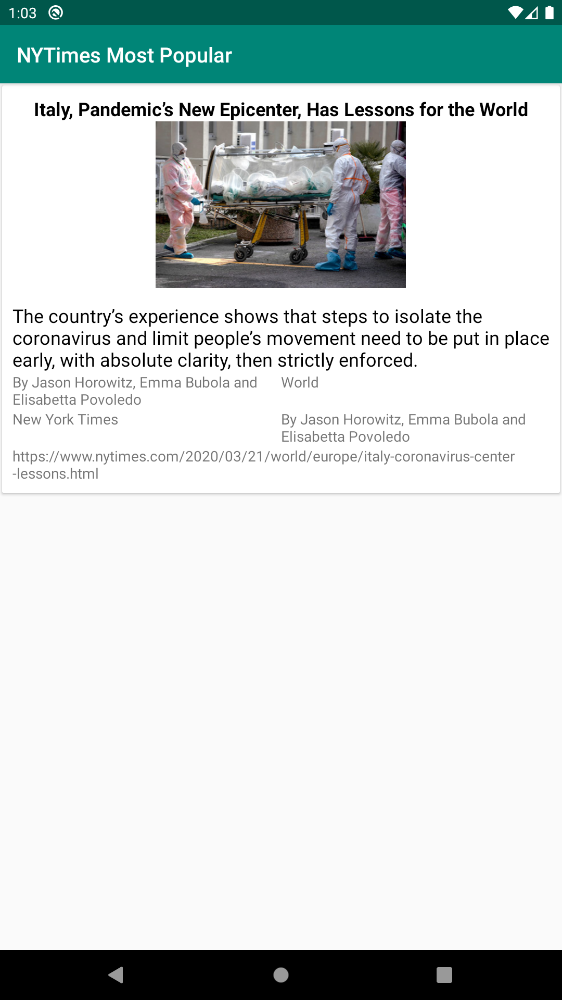

# NYTimes
Build a simple app to hit the NY Times Most Popular Articles API and show a list of articles, that shows details when items on the list are tapped (a typical master/detail app). You should use either Android (Kotlin).

I am using Model–view–ViewModel (MVVM) architectural pattern and Some of Android Jetpack Components 

## Developed Features
1. Recyclerview 
2. Data Binding
3. Retrofit2 for server call and Live Data
4. Kotlin
5. Androidx & swiperefreshlayout & Constraintlayout
6. Lifecycle - ViewModel
7. Navigation 
8. Koin for Dependency Injection

## Contributing
All pull requests are welcome, make sure to follow the contribution guidelines when you submit pull request.

1. Fork it!
2. Checkout the development branch: git checkout development
3. Create your feature branch: git checkout -b my-new-feature
4. Add your changes to the index: git add .
5. Commit your changes: git commit -m 'Add some feature'
6. Push to the branch: git push origin my-new-feature
7. Submit a pull request against the development branch

 

